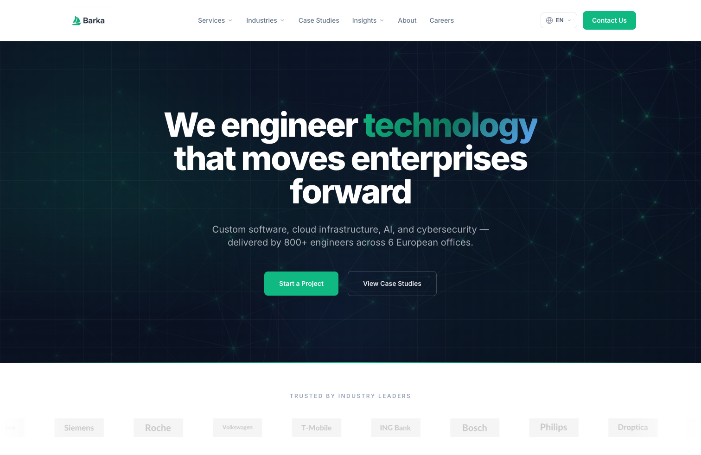
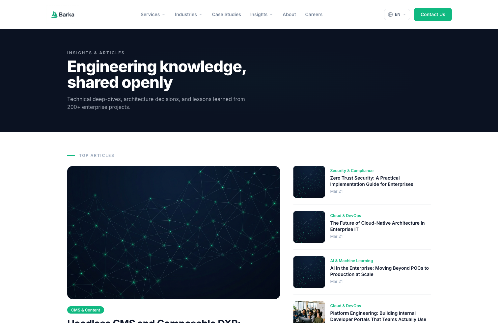
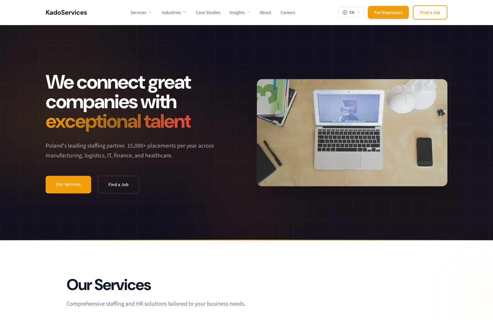
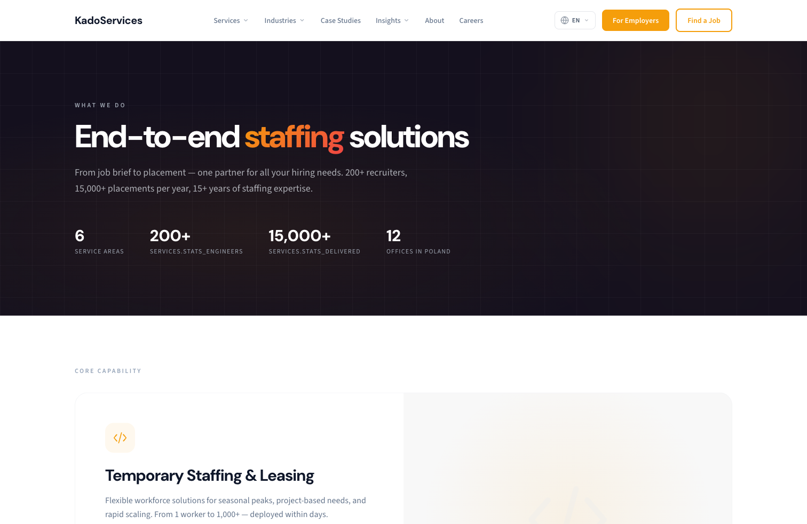
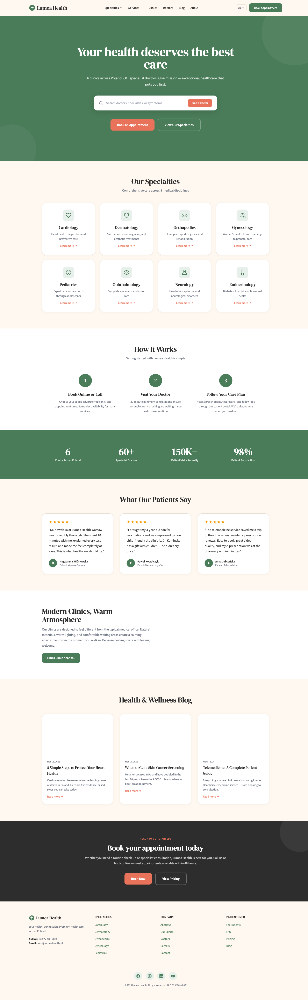
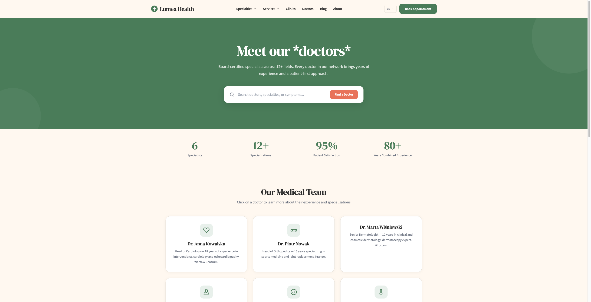

<p align="center">
  
</p>

<h1 align="center">Barka<br/>AI-Native Progressive Content-as-Code CMS</h1>

<p align="center">
  <strong>The first CMS designed for AI coding agents.</strong><br/>
  Write in Markdown. Configure in YAML. Let AI build features.<br/>
  Start as a static site generator — grow into a full CMS when you need it.
</p>

<p align="center">
  <a href="https://github.com/barkajs/barka/blob/main/LICENSE"></a>
  <a href="https://github.com/barkajs/barka/pulls"></a>
  <a href="https://github.com/barkajs/barka"></a>
  <a href="https://hono.dev"></a>
</p>

<p align="center">
  <a href="#for-ai-coding-agents">AI Agents Prompt</a> · <a href="#quickstart">Quickstart</a> · <a href="#features">Features</a> · <a href="#starters">Starters</a> · <a href="#comparison">Comparison</a> · <a href="https://github.com/barkajs/barka">GitHub</a>
</p>

> **Early Access — v0.1.0**
>
> Barka is in early development. The core engine, CLI, theme system, i18n, multi-site, and static build are functional and tested (151 unit tests). The admin UI and database layer work but are less polished. Some features (workflow approvals, scheduled publishing, role-based permissions) are planned but not yet implemented.
>
> We welcome testers, feedback, and contributions. If you hit a bug or have an idea — [open an issue](https://github.com/barkajs/barka/issues). If you build a site with Barka, we'd love to hear about it.

---

# What is Barka?

Barka is the first **progressive CMS built for AI agents**. It bridges the gap between static site generators and traditional content management systems — combining the simplicity of Astro/Hugo (Markdown files, free hosting) with the power of a full CMS (structured content, page builder, multi-language, admin UI).

**Born from real frustration.** Barka was created after extensive work with AI coding agents (Claude Code, Cursor, Codex, Copilot) on existing CMS platforms — Payload, Astro, Drupal, WordPress, Strapi. The problems hit hardest in the scenarios that matter most for marketing teams: multi-language sites across multiple domains, rapid creation of custom landing pages, and high-volume content publishing (blog posts, case studies, service pages). Every existing CMS made these tasks painful with AI — complex configs, binary formats, database-dependent workflows, and opaque abstractions meant that building a simple landing page with AI required fighting the framework instead of creating content.

**Barka is designed to be the #1 CMS for marketing-driven companies** that need rich, multi-language websites across multiple domains — and need to publish a lot, fast. With AI agents, you can generate a complete landing page with 10 sections in minutes, translate it to 3 languages instantly, and deploy to a new domain without touching the admin panel. Barka was built to eliminate every barrier between "I need a page" and "it's live."

**Designed from the ground up for AI-assisted development.** Content in Markdown, config in YAML, themes in JSX — all plain text formats that AI coding agents can read, modify, and extend without APIs or authentication. The repo ships with `CLAUDE.md` and `INVARIANTS.json` — built-in guardrails that keep AI agents aligned with project rules across tasks. An AI agent can create an entire website — content, theme, config — in a single session.

**No database required to start.** Content lives in Markdown files and YAML configs — version-controlled with Git, deployable to Cloudflare Pages for $0. When editors need a UI, add SQLite with one command and unlock a full admin panel.

## Why Barka?

- **Built for AI Agents** — Every file is plain text (Markdown, YAML, JSX). AI tools can create content, add features, modify themes, and extend the CMS — no API calls, no auth tokens, no binary formats. Ships with agent guardrails (`CLAUDE.md`, `INVARIANTS.json`) to prevent drift across tasks.
- **Progressive Complexity** — Start with files only, add a database when you actually need one. No upfront infrastructure decisions.
- **Zero JavaScript on Frontend** — Public pages ship 0 bytes of JS. Pure server-rendered HTML with perfect Lighthouse scores.
- **Full Code Ownership** — No vendor lock-in, no SaaS fees. Your content lives in Git. Self-host anywhere or deploy static for free.
- **Enterprise-Grade Features** — Page builder with 15 section types, multi-language, multi-site, taxonomy, revisions — without the complexity of traditional CMS platforms.

---

## For AI Coding Agents

Copy the prompt below into **Claude Code**, **Cursor**, **Codex**, **Aider**, or any AI coding tool to start building a new Barka site. The agent will gather requirements, scan your existing website, create a plan, and build a customized site.

````markdown
# Build a new website with Barka CMS

## Role

You are a senior full-stack web developer specializing in CMS-based websites. You build
production-ready, multi-language marketing sites with clean architecture and pixel-perfect
theme customization.

## Context

You are building a website using **Barka** — an open-source, AI-native, progressive
Content-as-Code CMS. Content lives in Markdown/YAML files, themes use Hono JSX + Tailwind,
and everything is version-controlled with Git. Barka starts as a static site generator and
optionally grows into a full CMS with admin UI and database.

The project uses a **starter profile** (like a Drupal distribution) that bundles a premium
theme, demo content, and full configuration. Your job is to customize this starter for the
client's brand, content, and structure.

## Success criteria

The task is **done** when:
- All pages from the plan render correctly in the browser (`barka dev`)
- Navigation, footer, and mobile menu reflect the real site structure
- All configured languages work (content + UI translations)
- Brand colors, logo, and typography match the client's identity
- Contact info is real, not from the demo starter
- `barka build` produces a working static site

## Workflow

**IMPORTANT: Start by switching to plan mode** (e.g. `/plan` in Claude Code, or ask the
user to confirm planning before execution). Do NOT write code until the plan is approved.

## Phase 1 — Gather requirements

Ask me (the human) these questions one by one. Wait for all answers before proceeding.

1. **Company / website name** — What is the company called? What should the site title be?
2. **Existing website URL** — Do you have a current website? Paste the URL so I can:
   - Scan the site structure (pages, services, blog, about, contact)
   - Identify content that should be migrated (service descriptions, team, case studies)
   - Detect languages currently in use
   *(Note: automated color extraction from websites is unreliable — ask for colors separately.)*
3. **Brand colors** — Provide hex codes for your brand: primary, secondary, accent, and background
   colors (e.g. `#1E3A5F`, `#10B981`). If you don't have them yet, we'll use the starter defaults
   and you can customize later.
4. **Logo** — Paste a link to your logo file, or describe it if no file yet.
5. **Main goal** — What is the primary goal of the website?
   (lead generation, brand awareness, recruitment, e-commerce, portfolio, etc.)
6. **Services / products** — What does the company offer? List the main services or product
   categories. (If I already scanned your website, I'll suggest what I found — confirm or correct.)
7. **Target audience** — Who are the ideal customers? Which industries?
8. **Languages** — How many languages are needed and which ones? (e.g. EN + PL, EN only)
9. **Content plan** — What content do you want to publish regularly?
   (blog posts, case studies, landing pages for campaigns, job offers, etc.)

## Phase 2 — Analyze existing site (if URL provided)

If the user provided a website URL:

1. Use web fetch / browser tools to scan the site
2. List all pages found (nav structure, footer links, sitemap if available)
3. Identify content types present (services, blog, case studies, team, locations, etc.)
4. Note the typography if visible in inline styles (heading font, body font)
5. Report findings to the user: "I found X pages, Y services, Z blog posts.
   Here's what I suggest migrating..."
6. If the user didn't provide brand hex codes in Phase 1, ask for them now.
   Web fetch cannot reliably extract colors from bundled/dynamic CSS.
7. Ask the user to confirm or adjust

## Phase 3 — Choose starter and create project

Based on answers, pick the best starter:

| Starter | Best for | Theme style |
|---------|----------|-------------|
| `lokatech` | IT, software, consulting, digital agencies | Dark navy + emerald |
| `kadoservices` | HR, staffing, recruitment, business services | Warm amber + deep plum |
| `lumea-health` | Healthcare, clinics, medical centers, wellness | Sage green + coral, warm serif |
| `blank` | Custom design, e-commerce, portfolio | Minimal base theme |

> More starters coming. Pick the closest match and customize.

Tell the user which starter you recommend and why. After confirmation, create the project:

```bash
npx create-barka-app [project-name] --starter <recommended>
cd [project-name]
```

This installs `@barkajs/barka` from npm and initializes with the chosen starter
(copies content, config, and theme). Read `CLAUDE.md` and `INVARIANTS.json` — follow
these rules strictly throughout the project.

> **Tips:** If port 3000 is busy, use `barka dev --port <free_port>`.
> The `public/ not found` warning is harmless — static files are served from `themes/*/static/`.

## Phase 4 — Create the plan

Create a file called `BARKA_PLAN.md` in the project root:

```markdown
# Barka Site Plan — [Company Name]

## Requirements
- Company: [name]
- Goal: [goal]
- Languages: [list]
- Existing site: [URL or "none"]
- Brand colors: primary [#xxx], secondary [#yyy], accent [#zzz]
- Starter: [chosen starter and reason]

## Checklist

### Configuration
- [ ] Configure settings.yaml (site name, URL, brand colors)
- [ ] Configure languages.yaml
- [ ] Configure sites.yaml (domain, localhost)
- [ ] Update translations (config/translations/*.yaml) — nav, footer, CTA text

### Content
- [ ] Homepage — customize hero, features, CTA sections
- [ ] About page — company story, mission, values
- [ ] Services — [list each service page]
- [ ] Blog posts — [number] articles to create/migrate
- [ ] Case studies — [list if applicable]
- [ ] Team page — [list members if applicable]
- [ ] Contact page — address, form, map
- [ ] [Other pages found on existing site]

### Translations (per non-default language)
- [ ] [lang] — homepage.yaml
- [ ] [lang] — navigation labels (config/translations/[lang].yaml)
- [ ] [lang] — service pages
- [ ] [lang] — about, contact pages

### Theme customization
- [ ] Update navigation in `layouts/base.tsx` — mega menu, footer links, mobile nav (see ⚠️ below)
- [ ] Sync translation keys — every `_t()` key in base.tsx must exist in `config/translations/*.yaml`
- [ ] Update brand colors in `theme.yaml` → `design_tokens` section
- [ ] Replace logo
- [ ] Verify contact info (address, phone, email) matches the real company

### Verification
- [ ] `barka dev` — all pages render correctly
- [ ] Check all languages and language switcher
- [ ] Check mobile responsiveness
- [ ] Verify all navigation links work
- [ ] `barka build` — static build succeeds
```

**Show this plan to the user and wait for approval before executing.**

## Phase 5 — Execute the plan

After plan approval, work through the checklist:

1. Customize `config/settings.yaml` — site name, URL, brand colors from scan.
2. Configure `config/languages.yaml` and `config/translations/*.yaml`.
3. Replace demo content in `content/` with real pages tailored to the company.
   - For each page migrated from the old site, create the content file
   - For each non-default language, create translated files (`.pl.md`, `.pl.yaml`)
4. Customize the theme:
   - ⚠️ **Navigation lives in `themes/[theme]/layouts/base.tsx`**, NOT in `partials/header.tsx`
     or `partials/footer.tsx`. The partials exist but are NOT used by the default base layout.
     Editing them has no visible effect.
   - In `base.tsx`, find all `const` arrays with nav/footer links (names vary per starter,
     e.g. `megaServices`, `footerCompany`, `navItems`). Update them to match your site structure.
   - After changing any `_t('key')` reference in base.tsx, add the same key to
     `config/translations/*.yaml` for **every** configured language. Missing keys render as raw
     key strings on the page.
   - Update brand colors in `theme.yaml` → `design_tokens`, not in CSS files directly.
   - Blog listing sections use `content_type` to auto-query articles from `content/` —
     no need for inline items with hardcoded URLs.
   - Verify contact data (address, phone, email) is from the real company, not the demo starter.
5. Mark each completed item as `[x]` in `BARKA_PLAN.md`.

## Phase 6 — Verify

```bash
barka dev
# Open http://localhost:3000
```

Check every page, every language, navigation, footer, mobile view.
Mark verification items as done in `BARKA_PLAN.md`.

## Rules

- NEVER delete content/, config/, or themes/ directories
- NEVER hardcode language prefixes (/pl/, /de/) — use `_url()` and `_t()`
- NEVER edit `partials/header.tsx` or `partials/footer.tsx` for navigation — edit `layouts/base.tsx` instead
- Every `_t()` key used in templates MUST have a matching entry in `config/translations/*.yaml` for all languages
- Content files use YAML frontmatter; landing pages are pure YAML with sections
- UI strings in `config/translations/<lang>.yaml` — not hardcoded in JSX
- Update `BARKA_PLAN.md` checklist as you complete each step
````

---

# Features

**Content as Code**
Write content in Markdown with YAML frontmatter. Define content types, taxonomies, and section types in simple YAML config files. Everything is a file — version-controlled, diffable, AI-friendly.

**Page Builder — 15 Section Types**
Compose landing pages from reusable sections: Hero, Features, CTA, Testimonials, FAQ, Pricing, Gallery, Counters, Logo Slider, Text with Image, Blog Listing, Columns, Video, Form, and Text. Each section supports per-instance settings (background, spacing, width, CSS class).

**Single Directory Components (SDC)**
Each section component lives in its own directory with co-located template (`.tsx`), scoped styles (`.css`), and schema definition (`schema.yaml`). CSS is automatically collected and served via a dynamic `/static/components.css` route — no build step needed.

```
themes/lokatech/components/
├── hero/
│   ├── hero.tsx          # Hono JSX template
│   ├── hero.css          # Scoped styles (animations, gradients)
│   └── schema.yaml       # Field definitions
├── features/
│   ├── features.tsx
│   ├── features.css
│   └── schema.yaml
└── ... (15 components)
```

**Starter Templates**
Ready-made starter templates for different industries. Each starter bundles a premium theme, config, and demo content. After `barka init`, everything is yours to customize — framework updates never touch your files.

**Admin UI with HTMX**
A full content management interface at `/admin` — content CRUD with revisions, section builder, media library, taxonomy management, user accounts, settings. Built with server-rendered HTML + HTMX for instant interactivity. No React, no JS build step.

**Multi-Language**
Built-in i18n via filename suffixes (`about.pl.md`, `about.de.md`). Language negotiation (URL prefix → cookie → Accept-Language). Hreflang tags auto-generated. A scalable **language switcher** (dropdown: code + label, active checkmark) lives in the header and matches mobile drawer styling. On the **default language**, URLs have no prefix (`/`); prefixed routes (`/pl/...`, `/de/...`) serve the matching translation. If two files share the same slug (e.g. `page.md` and `page.pl.md`), the unprefixed URL always resolves to the **site default language** — not “first file on disk.” Listings (`/articles`, `/case-studies`, `/services`) filter by language so you never mix EN and PL on the same index. Config in one YAML file:

```yaml
# config/languages.yaml
default: en
languages:
  en:
    label: "English"
    direction: ltr
  pl:
    label: "Polski"
    direction: ltr
```

**UI strings (theme / admin copy)**
Navigation labels, mega-menu copy, footer headings, and other **non-content** strings are not stored in Markdown. They live in `config/translations/<lang>.yaml` (dot keys, e.g. `nav.services: "Services"`). At render time the active theme receives a `t()` helper via theme settings (`themeSettings._t`) with fallback to the site default language.

**Base path & internal URLs**
Templates get **`_basePath`** (empty for the default language, or `/<lang>` when prefixed) and **`_url('/path')`** so links stay correct when the user is on `/pl/...` (logo, nav, footer, CTAs). You don’t hardcode `/pl` in JSX.

**Multi-Site / Multi-Domain**
Serve multiple sites from a single Barka instance. Each site can have its own domain, language set, and theme settings — while sharing the same components and content engine. Content **without** optional `siteId` in frontmatter is **shared** across sites; content **with** `siteId` is scoped to that site. `barka dev` prints a table mapping each site’s production domain to its `.localhost` alias and languages. Local development uses RFC 6761 `.localhost` subdomains (zero config, no `/etc/hosts` editing):

```yaml
# config/sites.yaml
sites:
  main:
    label: "Barka"
    domain: "barka.dev"
    localhost: "barka.localhost"        # http://barka.localhost:3000
    default_lang: en
    languages: [en, pl, de]

  blog:
    label: "Blog"
    domain: "blog.barka.dev"
    localhost: "blog.localhost"         # http://blog.localhost:3000
    default_lang: en
    languages: [en]
```

**Themes**
Theme system with inheritance and a resolution chain: `active theme → base theme → built-in fallback`. Themes include layouts, section components, partials, and static assets. Slug-specific templates (`page--contact.tsx`), collection listings (`index--articles.tsx`). Shipped inside starters so they're fully customizable.

**Bidirectional Sync**
Edit in files, edit in admin UI — it all stays in sync. `barka sync` merges changes from both directions with conflict detection. Export from DB to files for Git versioning anytime.

**SEO-First**
Zero JS on public pages. Auto-generated meta tags (Open Graph, Twitter), JSON-LD structured data, sitemap.xml, robots.txt, RSS feed, clean URLs, hreflang tags. Sitemap and RSS are **site-scoped** when multi-site is enabled. Static HTML output scores 100/100 on Lighthouse.

**Themed 404**
Unknown routes render through your active theme (navigation, language switcher, translated UI) — not a bare HTML error page.

**Mobile-First Navigation**
Responsive design with a hamburger menu that opens a slide-in drawer with full accordion sub-navigation (Services, Industries, Insights sub-items), app-style bottom navigation bar, and a prominent Contact CTA.

---

# Progressive Complexity

Barka grows with your project. Start simple, scale up only when needed.

```
Level 1: Files Only          Level 2: Dev Server          Level 3: + Database          Level 4: Full CMS
┌─────────────────┐          ┌─────────────────┐          ┌─────────────────┐          ┌─────────────────┐
│  content/*.md   │          │  barka dev      │          │  + SQLite       │          │  + Workflows    │
│  config/*.yaml  │   →      │  Hot reload     │   →      │  + Admin UI     │   →      │  + Approvals    │
│  barka build    │          │  Live preview   │          │  + Auth         │          │  + Scheduling   │
│  Deploy: $0     │          │  Local only     │          │  Deploy: $0-5   │          │  Deploy: $5-20  │
└─────────────────┘          └─────────────────┘          └─────────────────┘          └─────────────────┘
      No DB                        No DB                      SQLite                   SQLite or PG
```

---

# Quickstart

**Step 1:** Create a new Barka project:

```bash
npx create-barka-app my-site                      # default: lokatech starter
npx create-barka-app my-site --starter kadoservices  # HR/staffing starter
npx create-barka-app my-site --starter blank         # empty project
```

**Step 2:** Install dependencies and start:

```bash
cd my-site
npm install
npm run dev
```

**Step 3:** Open your site at `http://localhost:3000`

**Step 4 (optional):** Add a database and admin UI:

```bash
npx barka db:init
```

Access the admin panel at `http://localhost:3000/admin`
Default credentials: `admin@example.com` / `Admin123!SecurePass`

## Prerequisites

- Node.js v20+
- npm, pnpm, or bun

That's it. No Docker, no PostgreSQL, no Redis — unless you want them later.

---

<h2 id="starters">Starter Profiles</h2>

Starters are ready-made website templates for different industries. Each starter bundles a premium theme, full configuration, demo content, and translations. Pick a starter, customize it for your company, and you're live. More starters are coming.

```bash
barka starters                       # list available starters
barka init --starter lokatech        # enterprise IT company
barka init --starter kadoservices    # staffing & HR company
barka init --starter lumea-health    # healthcare clinic
barka init --starter blank           # clean starting point
```

### LokaTech — Enterprise IT Demo (default)

A complete website for a fictional enterprise IT services company. Dark navy + emerald green theme with premium animations (floating blobs, grid patterns, glow lines, stagger reveals).

> **Live demo:** [demo01.barka.dev](https://demo01.barka.dev)

<table>
<tr>
<td><a href="https://demo01.barka.dev"></a></td>
<td><a href="https://demo01.barka.dev/articles"></a></td>
</tr>
<tr>
<td align="center"><em>Homepage</em></td>
<td align="center"><em>Articles</em></td>
</tr>
</table>

- **Content**: 62 files — 6 services, 6 industries, 8 case studies, 22 articles, 5 team members, 5 locations, homepage with 10 sections
- **Theme**: 14 layouts, 15 SDC section components, CSS-only mega menu, mobile drawer nav, frosted glass header
- **Languages**: EN + PL translations, language switcher, hreflang tags
- **Use case**: IT outsourcing, software house, digital agency, consulting firm

### KadoServices — Staffing & HR Demo

A complete website for a fictional staffing and HR services company. Warm amber + deep plum theme with a completely different visual language (numbered rows, split hero, dual CTA, slim dropdowns).

> **Live demo:** [demo02.barka.dev](https://demo02.barka.dev)

<table>
<tr>
<td><a href="https://demo02.barka.dev"></a></td>
<td><a href="https://demo02.barka.dev/services"></a></td>
</tr>
<tr>
<td align="center"><em>Homepage</em></td>
<td align="center"><em>Services</em></td>
</tr>
</table>

- **Content**: 42 files — 6 services (recruitment, temp staffing, RPO, consulting, branding, payroll), 6 industries, 3 case studies, 4 articles, 5 team members, 4 locations, homepage with 10 sections
- **Theme**: 14 layouts, 15 SDC components, DM Sans + Source Sans 3 typography, pre-footer dual audience strip
- **Languages**: EN + PL translations
- **Use case**: Staffing agency, HR consulting, recruitment firm, outsourcing company

### Lumea Health — Healthcare Demo

A complete website for a fictional private healthcare network. Sage green + coral + cream theme with serif headings (DM Serif Display), warm professional design.

> **Live demo:** [demo03.barka.dev](https://demo03.barka.dev)

<table>
<tr>
<td><a href="https://demo03.barka.dev"></a></td>
<td><a href="https://demo03.barka.dev/doctors"></a></td>
</tr>
<tr>
<td align="center"><em>Homepage</em></td>
<td align="center"><em>Doctors</em></td>
</tr>
</table>

- **Content**: 51 files — 15 services, 6 clinics, 6 doctors, 6 articles, pages (about, contact, pricing, FAQ, careers), homepage with 8 sections
- **Theme**: 8 layouts, 13 SDC components, DM Serif Display + Source Sans 3 typography, appointment form
- **Languages**: EN + PL translations
- **Use case**: Private clinic, hospital, medical center, wellness center, dental practice

### Blank — Clean Starting Point

Minimal setup for starting from scratch. Just a homepage, about page, and the base Starter theme.

- **Content**: 2 files — homepage + about page
- **Config**: 3 content types (article, page, landing_page)
- **Theme**: Starter base theme (clean, unstyled)
- **Use case**: Custom project where you build your own theme and content

### How to use a starter for a new site

```bash
# Create a new project
npx create-barka-app my-company

# Pick a starter that matches your industry
barka init --starter kadoservices --force

# Customize: edit content, change colors, add your logo
# Then start the dev server
barka dev
```

After init, you own everything:
- `content/` — your content, edit freely (or let AI agents generate it)
- `config/` — your content types, taxonomies, languages, sites
- `themes/` — your theme layouts, components, styles

Framework updates (`npm update @barkajs/barka`) never touch these directories.

---

# CLI

```bash
barka create <name>           # Scaffold a new project
barka init -s <starter>       # Initialize from a starter (lokatech, kadoservices, blank)
barka starters                # List available starter profiles
barka dev                     # Dev server with hot reload
barka build                   # Static HTML output to dist/
barka build --site X          # Build for a specific site
barka db:init                 # Initialize SQLite + seed data
barka import                  # Files → Database
barka export                  # Database → Files
barka sync                    # Bidirectional sync with conflict detection
```

---

# Content

Content lives in `content/` as Markdown with YAML frontmatter:

```markdown
---
title: "Getting Started with Barka"
type: article
status: published
date: 2026-03-21
fields:
  category: technology
  author: "Jane Doe"
  featured_image: "/static/images/article-hero.jpg"
---

Your markdown content here. Supports **bold**, *italic*, [links](https://example.com),
code blocks, images, and everything else Markdown offers.
```

Landing pages use pure YAML with sections:

```yaml
title: "Homepage"
type: landing_page
status: published
sections:
  - type: hero
    heading: "Build websites the simple way"
    subheading: "Content in files. Deploy anywhere."
    cta_text: "Get Started"
    cta_url: "/docs"
    settings:
      background: dark
      spacing: large
  - type: features
    heading: "Why Barka?"
    items:
      - title: "Files First"
        description: "No database needed to start"
        icon: "file-text"
```

## Multi-Language Content

Add a translation by creating a file with a language suffix:

```
content/
├── articles/
│   ├── platform-engineering.md       # English (default)
│   └── platform-engineering.pl.md    # Polish translation
├── pages/
│   ├── contact.md                    # English
│   └── contact.pl.md                # Polish
└── landing-pages/
    ├── homepage.yaml                 # English
    └── homepage.pl.yaml             # Polish
```

The system automatically detects the language from the filename, associates translations with the same slug, and serves them at prefixed URLs (`/pl/articles/platform-engineering`).

**Missing translation:** If there is no content file for a language (e.g. no German homepage), that URL may show a **404** — UI chrome still uses `config/translations/de.yaml` for nav/footer. Add `homepage.de.yaml` (or the relevant `.de.md`) when you want a full page.

---

# Configuration

All configuration in `config/` — simple YAML files:

| File | Purpose |
|------|---------|
| `settings.yaml` | Site name, URL, theme, SEO defaults |
| `content-types.yaml` | Content type definitions with fields |
| `section-types.yaml` | Section types for the page builder |
| `languages.yaml` | i18n language definitions |
| `taxonomies.yaml` | Vocabularies and terms |
| `sites.yaml` | Multi-site domains, per-site languages, `.localhost` aliases |
| `translations/*.yaml` | UI strings per language (`en.yaml`, `pl.yaml`, …) — keys consumed by `t()` in themes |

---

<h2 id="testing-smoke">Smoke tests (manual / Playwright)</h2>

After changes to routing, i18n, `sites.yaml`, or theme navigation, verify at least:

| Area | Checks |
|------|--------|
| **EN** | `/` — logo → `/`, nav without `/pl`, English body copy |
| **PL** | `/pl` — logo → `/pl`, nav/footer links prefixed `/pl/`, Polish copy where translated |
| **Same slug, two langs** | `/services/...` = default lang; `/pl/services/...` = Polish — no cross-leak |
| **Listings** | `/articles` vs `/pl/articles` — only items for that language |
| **404** | `/missing` vs `/pl/missing` — themed page + matching nav language |
| **Switcher** | Dropdown lists all configured languages; links use correct prefix |

Use Playwright MCP or manual browser testing to verify all routes.

---

# Tech Stack

| Layer | Technology | Why |
|-------|-----------|-----|
| Web framework | **Hono** | Ultrafast, runs on Cloudflare Workers, Bun, Deno, Node.js |
| Database | **SQLite** (optional) | Zero-config, embedded, no server process |
| ORM | **Drizzle** | Type-safe, SQL-like API, lazy-loaded |
| Admin UI | **HTMX** | Server-rendered interactivity, no JS build step |
| Templates | **Hono JSX** | Fast server-side rendering |
| Styling | **Tailwind CSS** | Utility-first, CDN-friendly |
| CLI | **Commander.js** | Standard Node.js CLI framework |
| Content | **gray-matter** + **marked** | Frontmatter parsing + Markdown rendering |

---

<h2 id="comparison">Comparison vs Other Tools</h2>

| Feature | Astro | Hugo | Drupal | WordPress | Payload CMS | Keystatic | **Barka** |
|---------|:-----:|:----:|:------:|:---------:|:-----------:|:---------:|:---------:|
| Content in files | :white_check_mark: | :white_check_mark: | :x: | :x: | :x: | :white_check_mark: | :white_check_mark: |
| Admin UI for editors | :x: | :x: | :white_check_mark: | :white_check_mark: | :white_check_mark: | Partial | :white_check_mark: |
| Page builder / sections | :x: | :x: | :white_check_mark: | :white_check_mark: | :white_check_mark: | :x: | :white_check_mark: |
| Starter templates | :x: | :x: | :white_check_mark: | :x: | :x: | :x: | :white_check_mark: |
| Database optional | :white_check_mark: | :white_check_mark: | :x: | :x: | :x: | :white_check_mark: | :white_check_mark: |
| Multi-language | Plugin | Built-in | Built-in | Plugin | Plugin | :x: | Built-in |
| Multi-site | :x: | :x: | :white_check_mark: | :white_check_mark: | :x: | :x: | :white_check_mark: |
| Content revisions | Git | Git | DB | DB | DB | Git | Git + DB |
| 0 JS on frontend | :x: | :white_check_mark: | Depends | :x: | Depends | :white_check_mark: | :white_check_mark: |
| AI-friendly content | :white_check_mark: | :white_check_mark: | :x: | :x: | Partial | Partial | :white_check_mark: |
| Free static hosting | :white_check_mark: | :white_check_mark: | :x: | :x: | :x: | :white_check_mark: | :white_check_mark: |
| Self-contained | :x: | :white_check_mark: | :x: | :x: | :x: | Partial | :white_check_mark: |
| SDC / co-located styles | :white_check_mark: | :x: | :white_check_mark: | :x: | :x: | :x: | :white_check_mark: |
| Setup complexity | `npm create` | `brew install` | Docker + server | PHP + MySQL | Node + DB | `npm create` | **`npx create-barka-app`** |
| Hosting cost | $0 | $0 | $10-50/mo | $5-30/mo | $10-30/mo | $0 | **$0-5/mo** |

---

# Project Structure

```
my-site/
├── content/                  # Your content (Markdown + YAML)
│   ├── articles/             # Blog posts (+ .pl.md translations)
│   ├── pages/                # Static pages (about, contact)
│   ├── services/             # Service pages
│   ├── case-studies/         # Case studies
│   ├── industries/           # Industry pages
│   ├── landing-pages/        # Homepage and landing pages (YAML sections)
│   ├── team/                 # Team member profiles
│   └── locations/            # Office locations
├── config/                   # Configuration (YAML)
│   ├── settings.yaml         # Site name, theme, SEO
│   ├── content-types.yaml    # Content type definitions
│   ├── section-types.yaml    # Section types for page builder
│   ├── languages.yaml        # en, pl, de
│   ├── taxonomies.yaml       # Vocabularies and terms
│   ├── sites.yaml            # Multi-site domains
│   └── translations/         # UI strings per locale (en.yaml, pl.yaml, …)
├── themes/                   # Themes (Hono JSX + SDC)
│   ├── lokatech/             # Active theme
│   │   ├── theme.yaml        # Theme config
│   │   ├── layouts/          # Page templates
│   │   ├── components/       # Section components (hero/, features/, cta/, …)
│   │   └── static/           # CSS, images, fonts
│   └── starter/              # Base theme (fallback)
├── node_modules/@barkajs/barka/  # Framework (npm, updatable)
├── package.json              # { "@barkajs/barka": "^0.1.0" }
├── tsconfig.json             # JSX config for theme templates
└── dist/                     # Build output (generated)
```

---

# Contributing

Barka is an open source project and we welcome contributions. If you're interested in contributing, please read our contributing guide.

Found a bug or have a feature idea? [Create an issue](https://github.com/barkajs/barka/issues).

---

# Resources

- [GitHub Repository](https://github.com/barkajs/barka)
- [Issue Tracker](https://github.com/barkajs/barka/issues)

---

# License

[MIT](LICENSE)
